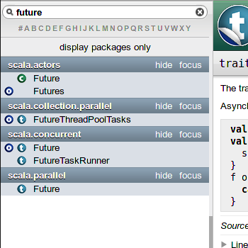

# Scala-Puzzlers

!SLIDE intro
# Scala-Puzzlers

Kriegsgeschichten aus Sprach- und Bibliotheksdesign <br />
*Oder: WTF, wer hat das gemergt?*


####  Simon Ochsenreither | [simon@ochsenreither.de](mailto:simon@ochsenreither.de)

!NOTE left top
#Über mich

* Seit > 3 Jahren bei Scala (Bugs, ...)
* Seit ~ 2 Jahren Commits

=> Statistik

!SLIDE left top
# Was ist Scala?

**Objektorientiert und funktional**

*“A drunken Martin Odersky sees a Reese's Peanut Butter Cup ad featuring somebody's peanut butter getting on somebody else's chocolate and has an idea.<br /> He creates Scala, a language that unifies constructs from both object oriented and functional languages. This pisses off both groups and each promptly declares jihad.”* ¹

<small>¹ A Brief, Incomplete, and Mostly Wrong History of Programming Languages

!SLIDE left top
# Was ist Scala?

**Objektorientiert und funktional**

**Statisch typisiert, mit lokaler Typinferenz**

``` text/x-scala
val hi: String = "Hallo GPN!"
```

**Kompiliert zu JVM-Bytecode**

!SLIDE left top
# Um was gehts?

  * **Keine Einführung** in die Sprache …
  * … aber jedes Code-Beispiel wird erklärt
  * Kleine & größere **Probleme beim Design** der …
    * Sprache
    * Standardbibliothek
  * Was kann man daraus lernen?

!SLIDE left top
# The Three Laws of <br/> Programming Language Design

Joe Armstrong:

* *What you get right nobody mentions*
* *What you get wrong, people bitch about*
* *What is difficult to understand you have to explain to people over and over again*

<br />
Wir beschäftigen uns mit den letzten beiden Punkten

!SLIDE left top
# Komplexitätsbudget

* Die Suche nach effizienten Investitionen
* Kombinierbarkeit von Sprachfeatures erhöht Komplexität

!SLIDE green
# „Nur noch *ein* Feature, versprochen!“


!SLIDE left top green
# Die verflixte Un**gleich**ung ...

``` text/x-scala
// Multipliziere a und b:
def multiply(a: Int, b: Int) { a * b }

// Addiere a und b:
def add(a: Int, b: Int) = { a + b }

// Wir prüfen Ergebnis von (5 + 2) * 3:
val result =
  (5 + 2) * 3 == multiply(add(5, 2), 3)
```

!SLIDE left top green
# ... ist eine **Prozedur**

* Methoden ohne Rückgabewert heißen Prozeduren
* Prozeduren haben den Rückgabetyp `Unit` (`void`)
* Verschiedene, äquivalente Deklarationsmöglichkeiten

``` text/x-scala
def foo1() { 1 + 2 }
def foo2() = 1 + 2
def foo3(): Unit = { 1 + 2 }
```

!SLIDE left top green
# Methoden in Interfaces

``` text/x-scala
trait ExampleInterface {
  def add(a: Int, b: Int): Int
  def foo() // <-- Fehlt hier nicht was?
}
```

!SLIDE left top green
# Operatoren ...

* Lesbarkeit

``` text/x-scala
1 + 2 * 3 / 4 - 5
minus(add(1, divide(multiply(2, 3), 4)) - 5)
```

!SLIDE left top green
# ... oder „sybolische Methodennamen“?

* Scalas Ansatz:
  * (Fast) freie **Methodenbenennung**

``` text/x-scala
// "Madonna wearing a button-down shirt" operator
// oder auch "Angry Donkey" operator
def <:< = ???
```

!SLIDE left top green
# ... oder „sybolische Methodennamen“?

* Scalas Ansatz:
  * (Fast) freie **Methodenbenennung**
  * Methoden mit einem Argument können **Operator-Notation** nutzen

``` text/x-scala
val hello = "Hello GPN".take(5)
```

``` text/x-scala
val hello = "Hello GPN" take 5
```

``` text/x-scala
val three: Int = 1 + 2
```

``` text/x-scala
val three: Int = 1.+(2)
```

!SLIDE green
# Die Sache mit dem **Doppelpunkt** …


!SLIDE left top green
# Die Sache mit dem **Doppelpunkt** …
* Wenn eine Methode mit `:` endet, …
  * dann ist sie **rechts**assoziativ …
  * aber nur in **Operator-Notation**!

``` text/x-scala
val list1 =  1  :: 2  :: 3  :: Nil

val list2 = Nil.::(3).::(2).::(1)

assert(list1 == list2)
```

!SLIDE green
# <br/>**Fazit**<br/>Weniger ist oft mehr!<br/><br/>


!SLIDE purple
# „Ach, war Java schön!“

!SLIDE left top purple
# Da ist jeder Kommentar überflüssig ...

``` text/x-scala
// Note: \\u000A is Unicode for linefeed (LF)
val linefeed = "\\u000A"
print(linefeed)
```

!SLIDE left top purple
# Oktales

``` text/x-scala
val bond = 007
```

``` text/x-scala
val abc = "\\141\\142\\143"
```

!SLIDE left top purple
# Constant inlining

``` text/x-scala
// Datei A:
final val foo = 42

//Datei B:
def getFoo = foo
```

!SLIDE left top purple
# Constant inlining

``` text/x-scala
// Datei A:
final val foo = 42

//Datei B:
def getFoo = foo
```

* Tauscht Laufzeitabhängigkeit gegen Compilezeitabhängigkeit

!SLIDE left top purple
# Constant inlining

``` text/x-scala
// Datei A:
final val foo = 42

//Datei B:
def getFoo = foo
```

* Tauscht Laufzeitabhängigkeit gegen Compilezeitabhängigkeit
* Kein Performancegewinn zur Laufzeit
* Erhöhte Compilezeit

!SLIDE purple
# <br/>**Fazit**<br/>Anlehnung an andere Sprachen hat Vor- und Nachteile<br/><br/>

!NOTE left top pink
# Konstruktoren und Extraktoren

  * `unapply`

``` text/x-scala
val (one, two) = (1, 2)
```

``` text/x-scala
val 1 = 2
```

``` text/x-scala
case class Person(firstName: String,
                  lastName:  String)

val joe = Person("Joe", "Gulasch")
val Person(firstName, _) = joe
```

!SLIDE pink
# “Jede Menge Platz in der Bibliothek?”


!SLIDE left top pink
# Namensvetter beim Familientreffen


!SLIDE left top pink
# Optimistische APIs

 * Was passiert, wenn man vergisst, das Verhalten im Fehlerfall zu spezifizieren?
 * Methode `remove` akzeptiert zwei Argumente
   * Position, ab der Elemente enfernt werden
   * Anzahl der zu entfernenden Elemente

``` text/x-scala
import scala.collection.mutable.ListBuffer
val buf = ListBuffer(1, 2, 3)
buf remove (4, 4) // <-- Datenstruktur korrumpiert!
```

!SLIDE left top pink
# Parallele Albträume

* Datenstrukturen implementieren die Collection API
* Collection API unterstützt sequentielle und parallele Operationen

``` text/x-scala
def twice(i: Int) = i * 2

(1 to 1000) map twice
```

!SLIDE left top pink
# Parallele Albträume

* Datenstrukturen implementieren die Collection API
* Collection API unterstützt sequentielle und parallele Operationen

``` text/x-scala
def twice(i: Int) = i * 2

(1 to 1000) map twice
```

``` text/x-scala
def brokenTwice(i: Int) =
  if (i%42 == 0)
    throw new RuntimeException(s"Failed: $i")
  else i * 2

(1 to 1000) map brokenTwice
```

!SLIDE left top pink
# Parallele Albträume

``` text/x-scala
def brokenTwice(i: Int) =
  if (i%42 == 0)
    throw new RuntimeException(s"Failed: $i")
  else i * 2

(1 to 1000).par map brokenTwice
```

* Parallele Operationen mit mehreren Fehlschlägen?
  * Welche und wie viele Exceptions werden gemeldet?

``` text/x-scala
class CompositeThrowable(exceptions: Set[Exception])
```

!SLIDE left top pink
# Parallele Albträume

* Parallele Operationen mit mehreren Fehlschlägen:
  * Welche und wie viele Exceptions werden gemeldet?

``` text/x-scala
class CompositeThrowable(exceptions: Set[Exception])
```

* Wenn mehr als eine Exception auftritt, dann wird in `CompositeThrowable` ge-„wrappt“

!SLIDE left top pink
# Parallele Albträume

* Parallele Operationen mit mehreren Fehlschlägen:
  * Welche und wie viele Exceptions werden gemeldet?

``` text/x-scala
class CompositeThrowable(exceptions: Set[Exception])
```

* Wenn mehr als eine Exception auftritt, dann wird in `CompositeThrowable` ge-„wrappt“
* Hört sich völlig plausibel an, aber ...<br /> **Komplett nicht-deterministisches Exception-Handling!**

!SLIDE left top pink
# Parallele Albträume

* Hört sich völlig plausibel an, aber ...<br /> **Komplett nicht-deterministisches Exception-Handling!**

* Anzahl der Exceptions?
* Typ der Exception?
* Falsche Tests?
* Reproduzierbarkeit?

!SLIDE pink
# <br/>**Fazit**<br/>Genaue Spezifikation ist überlebenswichtig!<br/><br/>

!SLIDE pink
# <br/>**Fazit**<br/>Was ist das einfachste, was funktionieren könnte?<br/><br/>

!NOTE left top pink
#Testing/Dokumentation/Reflection

`scala.mobile`

!NOTE left top orange
#Sprache -> Bibliothek

classOf
isInstanceOf
asInstanceOf


!SLIDE orange
# Was kann man daraus lernen?

!SLIDE left top orange
#Basics

* (Verteilte) Versionskontrolle
* Bugtracking
* Test-Suites
* Continuous Integration
* Reviews und Coding-Standards
* Spezifikation

!SLIDE left top orange
#Fehlerbehebung


!SLIDE left top orange
#Fehlerbehebung

* Wird in Sprachen unterschiedlich gehandhabt
* Problem: Binär- und Sourcekompatibilität


!SLIDE left top orange
#Kompatibilität

* **Code-** oder **Binär**kompatibilität?
  * Java: “Never change anything, ever!”
  * C#: “It depends”
  * Python: “Where code goes to die”
  * PHP: — No comment —

!SLIDE left top orange
#Kompatibilität

* Minor- und Update-Releases sind source- und binärkompatibel
* Major-Releases sind **nicht** binärkompatibel
* Wie kann man diese Anforderungen garantieren?

!SLIDE left top orange
#Scala-Policy

* Muss mindestens 1 Major-Release lang als veraltet gekennzeichnet sein
* Beispiel:
  * Problem wird in 2.9 erkannt
  * Deprecated in 2.10
  * Entfernt/behoben in 2.11
* **Keine Regel passt für alle Projekte!**

!SLIDE left top orange
#Kompatibilität


!SLIDE left top orange
#Kriterien
* Qualität
  * `scala.mobile`: Seit 5 Jahren kaputt

!SLIDE left top orange
#Kriterien
* Qualität
``` text/x-scala
/** A basic pretty-printing library, based
  * on Lindig's strict version of Wadler's
  * adaptation of Hughes' pretty-printer.
  */
abstract class Document
```

!SLIDE left top orange
#Kriterien
* Qualität
``` text/x-scala
/** This class turns a regular expression
  * over `A` into a `NondetWordAutom` over
  * `A` using the celebrated position
  * automata construction (also called 
  * ''Berry-Sethi'' or ''Glushkov'').
  */
abstract class BaseBerrySethi
```

!SLIDE left top orange
#Kriterien
* Qualität
``` text/x-scala
/** NondetWordAutom, Berry-Sethi, Glushkov
```
<br/>
* Auswirkungen

!SLIDE left top orange
#Kriterien
* Qualität
``` text/x-scala
/** NondetWordAutom, Berry-Sethi, Glushkov
```
<br/>
* Auswirkungen
* Abhängigkeiten

!SLIDE left top orange
#Kriterien
* Qualität
``` text/x-scala
/** NondetWordAutom, Berry-Sethi, Glushkov
```
<br/>
* Auswirkungen
* Abhängigkeiten
* Alternativen

!SLIDE left top orange
#Kriterien
* Qualität
``` text/x-scala
/** NondetWordAutom, Berry-Sethi, Glushkov
```
<br/>
* Auswirkungen
* Abhängigkeiten
* Alternativen
  * `scala.actors` → Akka Aktoren

!SLIDE left top orange
#Deprecation

* Versionierung
``` text/x-scala
@deprecated("Use `Foo` instead.", "2.10")
class Bar
```

!SLIDE left top orange
#Deprecation

* Versionierung
* Präzision
  * Vererbung
``` text/x-scala
@deprecatedInheritance(
  "`Bar` will be made final.", "2.10")
class Bar
```

!SLIDE left top orange
#Deprecation

* Versionierung
* Präzision
  * Vererbung
  * Parameternamen
``` text/x-scala
def blubb(foo: Int)
```

!SLIDE left top orange
#Deprecation

* Versionierung
* Präzision
  * Vererbung
  * Parameternamen
``` text/x-scala
def blubb(@deprecatedName('foo)
          fuz: Int)
```

!SLIDE left top orange
#Deprecation

* Versionierung
* Präzision
  * Vererbung
  * Parameternamen
  * Überschreiben
``` text/x-scala
class Blubb {
  def bla = ???
}
```

!SLIDE left top orange
#Deprecation

* Versionierung
* Präzision
  * Vererbung
  * Parameternamen
  * Überschreiben
``` text/x-scala
class Blubb {
  @deprecatedOverriding(
    "`bla` will become final.", "2.10")
  def bla = ???
}
```

!SLIDE left top orange
#Resultate

**?** Procedures

✔ Oktale Literale

**?** Oktale Escapes

**?** Constant inlining

✔ `Future`s

✔ `ListBuffer`

✔ `CompositeThrowable`

!NOTE left top orange
# Scala Improvement Process

  * Je nach Größe der Änderung/Verbesserung sind manchmal verschiedene Prozesse notwendig

  * String Interpolation ([SIP-11](https://docs.google.com/document/d/1NdxNxZYodPA-c4MLr33KzwzKFkzm9iW9POexT9PkJsU/edit?hl=en_US))
  * Implicit Classes ([SIP-13](http://docs.scala-lang.org/sips/pending/implicit-classes.html))
  * Futures and Promises ([SIP-14](http://docs.scala-lang.org/sips/pending/futures-promises.html))
  * Value Classes ([SIP-15](https://docs.google.com/document/d/10TQKgMiJTbVtkdRG53wsLYwWM2MkhtmdV25-NZvLLMA/edit?hl=en_US))
  * Macros (experimental, [SIP-16](http://docs.scala-lang.org/overviews/macros/overview.html))
  * trait Dynamic ([SIP-17](https://docs.google.com/document/d/1XaNgZ06AR7bXJA9-jHrAiBVUwqReqG4-av6beoLaf3U/edit))
  * Feature Imports ([SIP-18](https://docs.google.com/document/d/1nlkvpoIRkx7at1qJEZafJwthZ3GeIklTFhqmXMvTX9Q/edit))
  * Reflection (experimental, [overview](http://docs.scala-lang.org/overviews/reflection/overview.html))

  * Rewritten Pattern Matcher

!SLIDE
# Danke!

!SLIDE
# Fragen?


